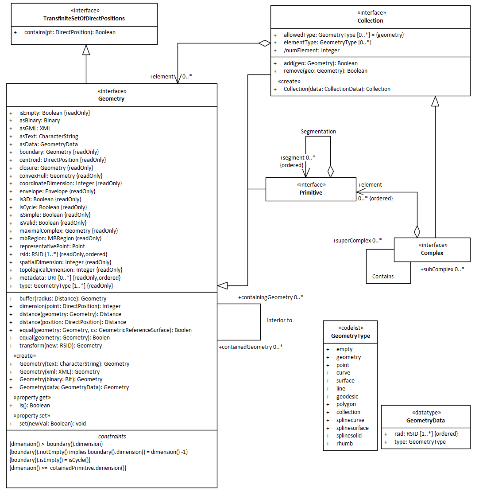
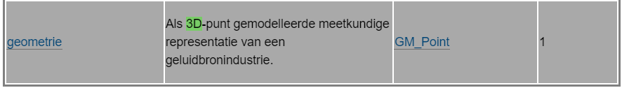
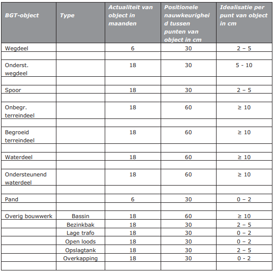
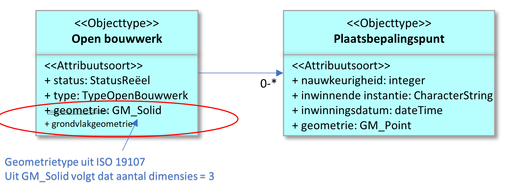
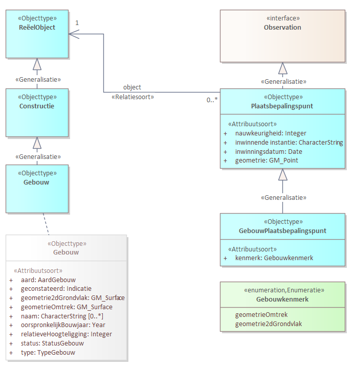
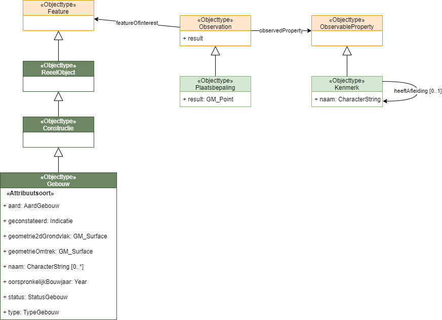
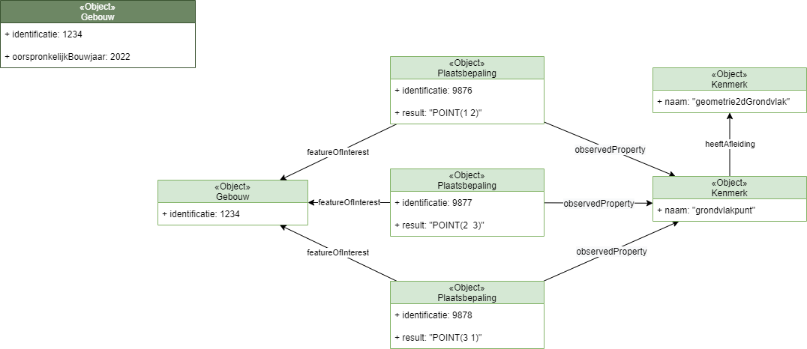
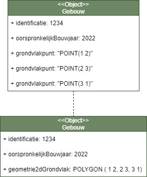
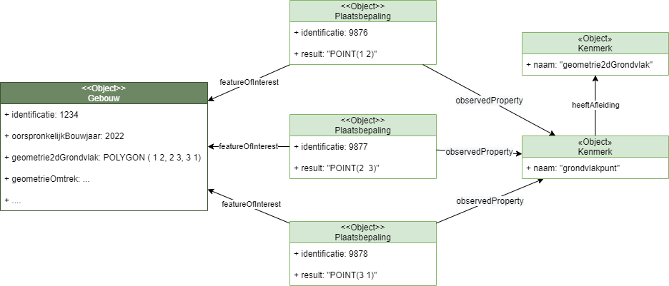

## Geometrie

### Uitgangspunten

Relevante input uit verschillende standaardenorganisaties en initiatieven:

Principes: 
- het gaat om het representeren van de locatie, orientatie en de vorm van objecten. 
- dimensionaliteit: 2D, 3D space versus 0D, 1D, 2D(, 3D) objecten

#### Coordinaatreferentiesystemen (CRS):
- WGS 84 gebaseerd op ITRS, gebruikt voor GPS
- European Terrestrial Reference System 1989 (ETRS89)
- Rijksdriehoek systeem (RD)
- Linear Reference Systems (LRS) (zie ISO 19148:2021, RWS-BPS, NWB, EU Inspire)

##### Ondersteunde CRS-en bij aanlevering:

We maken onderscheid tussen geometrieën die aangeleverd worden voor objecten binnen het Europese deel van Nederland en de Nederlandse Exclusieve Economische Zone (EEZ) van de Noordzee. Daarnaast maken we onderscheid tussen 2D- en 3D-geometrieën.

Voor objecten binnen het Europese deel van Nederland gelden de volgende CRS-en:
* RD
* ETRS89

Voor objecten binnen de EEZ geldt:
* ETRS89

Bij 2D geometrieen geldt de volgende EPSG code horende bij het CRS:
* RD - epsg:28992
* ETRF2000 - epsg:7931

Bij 3D geometrieen geldt de volgende EPSG code horende bij het CRS:
* RDNAP - epsg:7415
* ETRF2000 - epsg:9067

De keuze voor de ETRF2000 realisaties van ETRS89 baseren we op het advies uit [[gebruik-crs]], waarin het gebruik van ETRF2000 [wordt aangeraden](https://geonovum.github.io/HR-CRS-Gebruik/#realisaties-van-etrs89-en-evrs).

Ook zal bij aanlevering rekening gehouden worden met een lijnlengte van maximaal 200 meter, op basis van het [langelijnenadvies](https://forum.pdok.nl/uploads/default/original/2X/c/c0795baa683bf3845c866ae4c576a880455be02a.pdf) van het NSGI. Dit [wordt geadviseerd](https://geonovum.github.io/HR-CRS-Gebruik/#vormvastheid) in [[gebruik-crs]], in verband met compatibiliteit met RDNAPTRANS™.

##### Ondersteunde CRS-en bij uitlevering:

Bij uitlevering als RD dezelfde realisaties beschikbaar als bij aanlevering.

Bij uitlevering als ETRS89 kan de geometrie, naast als dezelfde realisaties als bij aanlevering, ook als de geografische ensemble CRSen opgevraagd worden. Te weten:
* ETRS89 - epsg:4258
* ETRS89 - epsg:4937

Uitlevering via de WGS 84 CRSen is ook mogelijk via nultransformatie [zoals beschreven](https://docs.geostandaarden.nl/crs/crs/#wgs-84-gelijkstellen-aan-etrs89-nultransformatie) in [[gebruik-crs]]. Het gaat specifiek om:
* WGS 84 - epsg:4326
* WGS 84 - epsg:4979

##### Nauwkeurigheid

Voor het aangeven van de nauwkeurigheid van de geometrieen in RD(NAP) en ETRS89 volgen we [het advies](https://docs.geostandaarden.nl/crs/crs/#nauwkeurigheid-van-coordinaten) van [[gebruik-crs]].

#### Technologieën (formaten, direct access methods: APIs/QLs, data languages)
ISO STEP tech:
- EXPRESS
- SPFF

W3C Base/XML tech: 
- HTML (also ISO & IEC: ISO/IEC 15445:2000(E))
- XML
- XSD
- XPATH
- XQuery
- CSS

W3C Linked Data / Semantic Web tech: 
- RDF, serialisations: Turtle, TriG, RDF-XML, JSON-LD
- languages: RDFS, OWL, SHACL, SHACL-AF
- SPARQL (often GraphQL frontend in case of JSON-LD serialisation). DE-9IM, 2-only!

ECMA/IETF JSON tech
- JSON (IETF RFC 8259)

GraphQL Foundation
- GraphQL, potential replacement for IETF's REST

IETF
- HTTP
- REST

OMG
- UML
- UMLtoOWL specs

#### Gremia en geometrie-gerelateerde specificaties
ISO
- ISO TC184 STEP, Part 42
- ISO TC211
    - ISO 19101 - reference model
    - ISO 19107 (2019) - spatial schema
    - ISO 19125-1, Simple Features Access; incl. WellKnownText (WKT) strings option
    - ISO TC5?

Open Geospatial Consortium (OGC)
- GML (XML based)
- CityGML using GML
- GeoSPARQL (Small ontology & set of topological functions; zie [Semantic web journal paper](http://www.semantic-web-journal.net/sites/default/files/swj176_0.pdf)
- JSON-FG, uitbreiding op GeoJSON, in ontwikkeling

CEN
- TC442 WG4 / TG 3 SML. == ~NEN 2660; small top level: abstract concept <> concrete concept with subclass Representation: SpatialEntity(/TempralEntity from W3C Time Ontology)

buildingSmart International (bSI)
- IFC (3D): 
    - IFC2x3, IFC4x1 (infra support like alignments), IFC4x3RC2. 
    - Placement (Location, Orientation). 
    - BREPS, ExtrudedSolid, BoundingBox, ... based on former ISO STEP Part 42,  Integrated generic resource: Geometric and topological representation

W3C
- Spatial Data on the Web Best Practices (w3.org) (also OGC) [[sdw-bp]] met ref naar  Spatial Thing (https://www.w3.org/2003/01/geo/), GeoSPARQL en GeoJSON. 

IETF
- RFC7946: GeoJSON [[rfc7946]]

Geonovum
- NEN 3610 [[NEN3610-2021-ontw]]
- Geometrie in model en GML [[gimeg]]
- Handreiking coördinaatreferentiesystemen [[gebruik-crs]]

Hieronder iets meer over NEN 3610 en de handreiking Geometrie in model en over inhoudelijke uitgangspunten uit EMSO. 

#### NEN 3610
NEN 3610 [[NEN3610-2021-ontw]] zegt weinig specifieks over geometrie en geometrische vastlegging van objecten, anders dan dat ISO 19107:2020 normatief wordt aangehaald, waarin de ISO geometrietypen (o.a. `GM_Point`, `GM_Curve`, `GM_Surface`, `GM_Solid`) worden gedefinieerd. 

Inwinregels worden in sectormodellen bepaald. 

> "Inwinregels geven aan welke punten van een object ingemeten moeten worden en waar de geometrie van een geregistreerd object aan moet voldoen. Het leidt tot een vastgestelde geometrische weergave gericht op een specifieke toepassing." 

Paragraaf 8.4.4.3 Geometrie bevat een aantal uitgangspunten:
- Geometrie is een representatie van een object.
- Een objecttype kan nul of meer geometrische representaties hebben.
- De beschrijving van de 3D-werkelijkheid wordt ondersteund.
- Hoogte-informatie kan absoluut of relatief zijn; hierover staat in NEN 3610 een goede uitleg.

Paragraaf 9.12 gaat in op topologische relaties en geeft hier gestandaardiseerde namen voor.

Hoofdstuk 10 bevat regels en handreikingen over coördinaatreferentiesystemen die van belang kunnen zijn voor de SOR. 

#### Geometrie in model 

De handreiking Geometrie in model en GML [[gimeg]] legt inhoudelijk uit hoe het geometriemodel uit ISO 19107 [[iso-19107-2019]] kan worden toegepast en wat het geldende Nederlands profiel is (i.e. welke selectie is gemaakt uit de mogelijke geometrietypen). 

Een eis uit [[EMSO]] is: 
> aansluiting op Simple Features (ISO 19125)

Simple Features maakt een selectie uit het ISO 19107 geometriemodel. Het neemt daaruit alleen de meest gebruikelijke geometrietypen over. 

<aside class="issue">ISO 19125 definieert een model voor <strong>2 dimensionale </strong> geometrietypen. 3D geometrie is uitgesloten in deze standaard. In EMSO wordt echter wel een behoefte aan 3D geometrie geformuleerd.</aside>

We hanteren dus Simple Features (ISO 19125) _+ een aantal aanvullingen voor zover nodig, waarschijnlijk in ieder geval voor bogen en volumes._

Simple Features gebruikt zoals gezegd geometrietypen uit de veel uitgebreidere standaard ISO 19107, waarin het volledige geometriemodel gedefinieerd is. De typen uit dit model hanteren we doorgaans als 'black box' typen of interfaces. Als achtergrondinformatie beschrijven we hier kort wat het geometriemodel van ISO 19107 inhoudt. 

<figure>
    
    <figcaption>Het Geometry object met al zijn kenmerken zoals gedefinieerd in het ruimtelijk schema van ISO 19107.</figcaption>
</figure>

Het Geometry object, waarvan alle specifieke geometrietypen zoals punt, lijn, vlak en volume afgeleid zijn, heeft veel kenmerken en operaties. Belangrijk voor ons zijn: 
- `SRID`: dit modelleert de verwijzing naar het "Spatial Reference system", in ons geval het coördinaatreferentiesysteem. 
- `metadata`: optioneel attribuut voor het opnemen van verwijzingen naar documentatie die informatie geeft over de implementatie van het geometrie-object. Dit kunnen we wellicht gebruiken voor bijvoorbeeld de gerealiseerde nauwkeurigheid van de geometrie.

<aside class="note">*Spatial reference system* is een breder begrip dan *coördinaatreferentiesysteem*. Het gaat om een algemene locatieaanduiding, een "ruimtelijk referentiesysteem" dat niet alleen op basis van coördinaten kan werken maar ook op basis van bijvoorbeeld geografische naam of adres. 
</aside>

#### Uitgangspunten uit EMSO
- De vastlegging van geometrie wordt zodanig vormgegeven dat de driedimensionale (3D) beschrijving van een object kan worden opgenomen.
- EMSO beschrijft een aantal algemene topologische regels over vlakdekkendheid en topologie, bv "Objecten op verschillende hoogten moeten goed op elkaar aansluiten waar ze elkaar raken en consistent zijn"
- Waar relevant wordt er kwaliteitsmetadata voor geometrieën opgenomen.
- De ruimtelijke dekking van de SOR is inclusief de territoriale zee.
- Het te gebruiken coördinatenstelsel is RD. 
- De [precisie](https://www.noraonline.nl/wiki/Geometrische_precisie) van coördinaten is op millimeterniveau en in RD betekent dit dat er coördinaten met 3 decimalen worden opgenomen.
- Gegeneraliseerde data objecttypen [worden niet opgenomen in de SOR](https://docs.geostandaarden.nl/disgeo/emso/#generalisatie). Ze kunnen wel onderdeel zijn van informatieproducten. Generalisatie is "het zinvol weglaten, vereenvoudigen, verplaatsen, vergroten, symboliseren en/of aggregeren van de geometrie van objecten (of op attribuutniveau)", ten behoeve van minder gedetailleerde kaartschalen.

<aside class ="issue">Is RD wel het juiste coördinaatreferentiesysteem? 

- Het te gebruiken coördinaatreferentiesysteem, RD, is niet toereikend voor objecten die zich niet op land bevinden maar op territoriale zee, zoals windturbines. Echter, de gewenste ruimtelijke dekking van de SOR is inclusief de territoriale zee. 
- Vanuit verschillende (basis)registraties is niet RD maar ETRS89 de eis. O.a. in de Omgevingswet (bron?). In het EMSO is van RD uitgegaan omdat veel bronhouders nog in RD werken. We moeten met experts bekijken of RD danwel ETRS op land de vereiste moet zijn. We kunnen hierbij ook gebruik maken van [hoofdstuk 3](https://docs.geostandaarden.nl/crs/cv-hr-crs-20211125/#aandachtspunten-bij-crs-in-informatiemodel-en-informatieketen) van de Handreiking CRS [[gebruik-crs]].
- Op zee zijn noch RD noch ETRS89 geschikt; het is gebruikelijk om daar WGS-84 te hanteren.
</aside>

### Modelleren van geometrie bij objecttype

<aside class="issue">We moeten gaan uitwerken hoe we de eigenschap geometrie modelleren. Is het een datatype of wiskundig object; of een bijzonder datatype of een interface. Of misschien modelleren als een objecttype `Locatie` (zoals [locn](https://www.w3.org/ns/locn)). 

Ook: Gebruiken we een attribuutsoort of relatiesoort om geometrie aan het objecttype te verbinden? 

</aside>

Semantisch gezien, vanuit de MIM gedachte, positioneren we de geometrie als een eigenschap van het object. De betekenis van een geometrie vereist altijd een context, bv. een attribuutsoort of relatiesoort van een objecttype. Bv.`begrenzing` of `bovenaanzicht`. 

Wiskundig gezien kun je zeggen dat de geometrie zelf een object is. Het is een set van coördinaten volgens een classificerende typering (surface, point enz) met samenhangende metadata die vereist is voor de interpretatie ervan (crs, …) waar je ruimtelijk mee kan rekenen. 

We gebruiken in ieder geval de ISO typen `GM_Surface` etc (zie ). In ISO hebben deze een complexe structuur. In geo-informatiemodellen worden deze typen meestal behandeld als `interface` en kunnen ze zowel aan een attribuut en aan een relatie worden gekoppeld.  OGC CityGML en IMGeo zijn voorbeelden van informatiemodellen waar met een relatie wordt gewerkt. 

In Linked Data (GeoSPARQL) wordt geometrie als een object gezien en ook in ISO 2660 is dit zo. Het is daar een abstract (in de zin van: wiskundig) object waarnaar je een relatie kan leggen.

### Geometrie-aspecten per objecttype

De volgende (meta)aspecten van geometrie moeten worden gedefinieerd per objecttype in het informatiemodel of de documentatie daarbij: 

#### Geometrietype
Het geometrietype wordt aangegeven door keuze van het juiste type uit het ISO 19107 Geometry Model (`GM_xxx`), passend binnen het profiel zoals gedefinieerd in [[gimeg]]. 

<figure>
    
    <figcaption>Het ruimtelijk schema van ISO 19107, geometrische primitieven.</figcaption>
</figure>

<aside class="issue">
Hierbij is het relevant om te definiëren en op schrijven welke varianten toegestaan zijn. Een `GM_Surface` of `GM_Curve` heeft nog allerlei mogelijke verschijningsvormen in het Geometry model. Voor de uitwisseling en het gebruik is het handig om dit in te perken.
</aside>

#### Dimensionaliteit
Het aantal dimensies kan impliciet worden aangegeven door geometrietype, aangevuld met een aanduiding dat het om 2.5D gaat in de definitie van het attribuut. 

`GM_Solid` is per definitie 3D, maar bij `GM_Surface`, `GM_Curve` en `GM_Point` (en composite/multi varianten hiervan) is het mogelijk om 2 of 3 posities per coördinaat op te nemen. De hoogte is dan de derde positie. Of de hoogte wel of niet wordt opgenomen in de coördinaten kunnen we aangeven in de definitie van het attribuut.

<aside class="example">
Definitie van het attribuut `geometrie` van een geluidbron in het Informatiemodel Geluid.
<figure>
    
    <figcaption>Voorbeeld geometrietype omschrijving IMGeluid</figcaption>
</figure>
</aside>

<aside class="issue">
Is het wenselijk om een semantisch attribuut `hoogte` te modelleren zodat te zien is wat de hoogte van het object is zonder naar de coördinaten te kijken? Waar zou je dit modelleren, in de geometrie of in het objecttype/gegevensgroeptype? Moet dit überhaupt wel? in EMSO staat het niet dus het lijkt geen inhoudelijke eis te zijn.
</aside>

#### 3D geometrie

<aside class="issue">Hoe we omgaan met 3D geometrie in de SOR moet nog verder worden uitgewerkt.

Een aantal vragen: 
- Is het mogelijk om van een object naast een 3D geometrie ook de 2D geometrie registreren? En is dat wenselijk? Op de korte termijn is er wellicht behoefte aan een flexibele aanbodkant waar organisaties als ze er aan toe zijn 3D kunnen aanleveren maar voorlopig wel 2D.
- Ook is er waarschijnlijk wel behoefte aan 2D geometrie bij afnemers. Is dit dan iets dat je in een product afleidt, of is het iets dat we in het informatiemodel ook modelleren?
- Kun je de 2D geometrie altijd afleiden uit de 3D geometrie?
</aside>

#### Nauwkeurigheidseisen
Wat onder nauwkeurigheid van geometrie wordt verstaan is goed gedefinieerd in standaarden. We gaan ervan uit dat wat in EMSO nauwkeurigheid wordt genoemd, hetzelfde is als [positionele juistheid](https://www.noraonline.nl/wiki/Positionele_juistheid) in het NORA raamwerk gegevenskwaliteit en hetzelfde als wat in de BGT positionele nauwkeurigheid wordt genoemd: 

> Onder positionele nauwkeurigheid verstaat men de mate waarin de opgeslagen coördinaten overeenkomen met de waarden in de werkelijkheid of de geaccepteerde afwijking.

Per objecttype geven we de toegestane kwaliteit voor de positionele nauwkeurigheid als een getal in centimeters (dat dan de toegestane afwijking weergeeft). MIM heeft hiervoor geen metadata-element. Een optie is om dit in een tabel vóór in de gegevenscatalogus op te nemen, zoals gedaan in de BGT catalogus op p. 23. 

<aside class="example">
<figure>
    
    <figcaption>Tabel met nauwkeurigheidseisen in de BGT gegevenscatalogus</figcaption>
</figure>
</aside>

Eventueel zou het ook in het MIM aspect `Regels` bij de geometrie eigenschap van het desbetreffende objecttype gezet kunnen worden. 

<aside class="issue">
- Zoeken naar een manier om dit machineleesbaar vast te leggen.

VOORSTEL: 

Leg dit vast in een te definiëren metadata aspect bij de eigenschap in een MIM extensie voor geo. Het heeft mogelijk toegevoegde waarde om dit bij de data te kunnen terugvinden.

Vastleggen bij eigenschap heeft voorkeur boven vastleggen bij objecttype, omdat er mogelijk meerdere geometrie-eigenschappen komen bij een objecttype (Levels of Detail).
</aside>

#### Inwinregels
Verreweg de meeste objecttypen in de SOR hebben in hun huidige registratie al enige vorm van inwinregels. Eventueel zouden inwinregels in het MIM aspect `Regels` bij het geometrie attribuut van het desbetreffende objecttype gezet kunnen worden. 

Omdat dit vaak omvangrijke instructies zijn, zijn ze nu meestal in tekst uitgeschreven in een apart handboek of hoofdstuk van de gegevenscatalogus. We zoeken naar een manier om deze teksten wel te relateren aan de bijbehorende modelelementen (annotatie).

#### Topologische regels
Voor ruimtelijke relaties tussen de objecten kunnen we gebruik maken van de topologische relaties zoals gedefinieerd in de Simple Features standaard [[iso-19125-1-2004]] en aangeraden in [[NEN3610-2021-ontw]] en [[sdw-bp]]. Deze relaties zijn geïmplementeerd in veel geografische softwareomgevingen en ook in GeoSPARQL: 

- **`Equals`** - gelijk
- **`Disjoint`** - disjunct (geen enkel punt gemeen)
- **`Touches`** - raakt
- **`Crosses`** - kruist
- **`Within`** - binnen
- **`Contains`** - bevat
- **`Intersects`** - doorsnijdt (geometrieën hebben op zijn minst één punt gemeen;
geometrieën kunnen verschillende dimensie hebben)

Deze relaties kun je gebruiken voor punt-, lijn- en vlakgeometrieën. Omdat er in de SOR meer met 3D wordt gewerkt, worden topologieregels complexer maar ook secundair aan de representatie van de werkelijke verhouding tussen objecten. Uit EMSO: 

> Het is belangrijker om ervoor te zorgen dat objecten die zich in de werkelijkheid op een bepaalde wijze tot elkaar verhouden (bijvoorbeeld een verharding ligt bovenop een overbrugging) ook in de registratie op deze wijze tot elkaar verhouden (bijvoorbeeld dat uit de z-coördinaten van de verharding en de overbrugging blijkt dat de verharding bovenop de overbrugging ligt). De exacte uitwerking van deze relaties in topologie-regels zal later in het traject verder worden opgepakt.

<aside class="issue">Welke objecttypen spelen een rol in de landsdekkendheid? Welke objecttypen hebben specifieke topologische relaties met elkaar? We hebben als modelleurs inhoudelijke expertise nodig om dit goed uit te werken.</aside>

#### Benodigde kwaliteitsmetadata

Wat voor kwaliteitsmetadata bij een objecttype wordt voorgeschreven, kan worden bepaald aan de hand van uitgangspunten in EMSO [§ 3.4.5](https://docs.geostandaarden.nl/disgeo/emso/#meta-gegevens-over-herkomst-en-kwaliteit). Dit kan zijn:
- plaatsbepalingspunten
- een brondocument / bronverwijzing anders dan plaatsbepalingspunten
- gerealiseerde nauwkeurigheid van de geometrie van het object in de vorm van een nauwkeurigheidsklasseaanduiding
- helemaal geen kwaliteitsmetadata

We gaan onze eerder uitgewerkte modelleerpatronen toetsen tegen dit onderwerp.

### Geometrie-object
Per individuele geometrie vastleggen:
- Coördinatenstelsel
- Geometrietype
- De coördinaten zelf
- Indien van toepassing, kwaliteitsmetadata zoals beschreven in .

Het volstaat om een ISO 19107 geometrietype toe te passen in het informatiemodel (zie  voor uitleg). Dit zorgt ervoor dat het coördinatenstelsel kan worden opgenomen, dat het geometrietype duidelijk is en dat de coördinaten zelf kunnen worden opgenomen.

<aside class="issue">
Heeft het meerwaarde om in het informatiemodel op te nemen in welk CRS een geometrie ingewonnen moet worden? Dat zou een metadata aspect kunnen zijn net zoals nauwkeurigheidseis.
</aside>

### Plaatsbepalingspunt
Plaatsbepalingspunten zijn van belang voor sommige geometrieën als metadata over de inwinning. 

Elk plaatsbepalingspunt wordt vastgelegd met de volgende kenmerken:
- Unieke aanduiding
- Coördinaten/puntgeometrie inclusief hoogte
- Nauwkeurigheid
- Inwinnende instantie
- Inwinningsdatum

De coördinaten van plaatsbepalingspunten moeten voorkomen in de coördinaten in de bijbehorende objectgeometrie, in de zin dat ze overeenkomen met één coördinatenpaar in deze objectgeometrie. Andersom geldt niet dat alle objectgeometrieën bijbehorende plaatsbepalingspunten hebben. Zie  voor de details.

<aside class="note">Deze regel kan alleen gecontroleerd worden als er een relatie is tussen object / geometrie en bijbehorende plaatsbepalingspunten.</aside>

#### Wanneer plaatsbepalingspunten? 

Bij een **objecttype** modelleren: als het een reëel object betreft EN de grens in het terrein goed is aan te wijzen (goed idealiseerbaar is).

Bij een **individueel object** verplicht opnemen: als de coördinaten daadwerkelijk ingewonnen zijn middels terreinbezoek (terrestrisch), laserscanning (laser), luchtfoto’s of panoramabeelden.

<aside class="issue">
Rondom modellering van `Plaatsbepalingspunt` zijn er nog vragen: 
- Is er een associatie tussen objecttype en `Plaatsbepalingspunt` nodig?
- Moet `Plaatsbepalingspunt` gerelateerd worden aan de reële objecttypen, of aan de geometrie zelf?
- Kan de relatie beter van objecttype naar `Plaatsbepalingspunt` gericht zijn of andersom?
- Is het een optie om `Plaatsbepalingspunt` te modelleren als O&M `Observation`?
- Het is niet wenselijk om van `Plaatsbepalingspunt` historie bij te houden bij een object. Hier rekening mee houden bij modellering.
</aside>

### Uitwerking

#### Optie 1

Deze uitwerking is geïnspireerd op de modellering in veel geo-informatiemodellen (sectormodellen van NEN 3610). 

In optie 1 hebben we de volgende keuzen gemaakt:
- Geometrie is gemodelleerd als attribuut. Modelleren als relatie lijkt vooralsnog niet nodig. CRS en andere metadata van de geometrie kunnen conform ISO 19107 worden opgenomen (zie .)
- De geometrie van het objecttype `OpenBouwwerk` is getypeerd als `GM_Solid`. 
- Er is een associatie gemodelleerd tussen objecttype en `Plaatsbepalingspunt`. Zonder een relatie tussen beiden levert het beheer van plaatsbepalingspunten problemen op, zo is in de BGT praktijk gebleken. Omdat het een reëel objecttype betreft, dat goed idealiseerbaar is, moeten plaatsbepalingspunten worden opgenomen *als* de geometrie is ingewonnen middels terreinbezoek (terrestrisch), laserscanning (laser), luchtfoto’s of panoramabeelden. Daarom is de relatie optioneel.
- `Plaatsbepalingspunt` is gerelateerd aan het reële objecttype.
- De relatie is gericht van objecttype naar `Plaatsbepalingspunt`.
- O&M is niet toegepast. 
- In het MIM aspect `Regels` is opgenomen wat de CRS van de geometrie moet zijn. 
- **Topologische regels** staan hier niet; deze worden bij het objecttype opgenomen (bijvoorbeeld dat het objecttype moet voldoen aan de vlakdekkendheidseis). 
- De **Positionele juistheid** (vernoemd naar NORA) en **inwinregels** zijn opgenomen in aparte, hiervoor toegevoegde metadata aspecten.

Problemen met deze modelleerwijze: 
- Omdat `Plaatsbepalingspunt` is gerelateerd aan het reële objecttype, is het niet goed mogelijk om plaatsbepalingspunten voor meerdere geometrieën bij één object te hebben. Je weet dan niet welk plaatsbepalingspunt bij welke geometrie hoort. 
- Semantisch gezien horen plaatsbepalingspunten eigenlijk bij de geometrie en niet bij het object. Ze zeggen iets over hoe de geometrie tot stand gekomen is. 

<aside class="example" id="geometrie-model-optie-1" title="Geometrie modellering, optie 1">
    <figure>
        
        <figcaption>Voorbeeld van het modelleren van geometrische aspecten, optie 1</figcaption>
    </figure>

MIM metadata van het attribuut `grondvlakgeometrie`:

<table>
  <tr>
    <th>Naam</th>
    <td>grondvlakgeometrie</td>
  </tr>
  <tr>
    <th>Herkomst</th>
    <td>https://docs.geostandaarden.nl/disgeo/emso/</td>
  </tr>
  <tr>
    <th>Definitie</th>
    <td>Geometrische representatie van een open bouwwerk <strong>in de vorm van een 3D volume</strong>.</td>
  </tr>
  <tr>
    <th>Herkomst definitie</th>
    <td>https://docs.geostandaarden.nl/disgeo/emso/</td>
  </tr>
  <tr>
    <th>Toelichting</th>
    <td>...</td>
  </tr>
  <tr>
    <th>Mogelijk geen waarde</th>
    <td>Nee</td>
  </tr>
  <tr>
    <th>Kardinaliteit</th>
    <td>1</td>
  </tr>
  <tr>
    <th>Patroon</th>
    <td>...</td>
  </tr>
  <tr>
    <th>Type</th>
    <td>GM_Solid</td>
  </tr>
  <tr>
    <th>Regels</th>
    <td>CRS aanlevering: RD/ETRS89</td>
  </tr>
  <tr>
    <th>Positionele juistheid</th>
    <td>30 cm.</td>
  </tr>
  <tr>
    <th>Inwinregels</th>
    <td>https://docs.geostandaarden.nl/disgeo/imsor-inwinning</td>
  </tr>
</table>

</aside>

#### Optie 2

Deze uitwerking is geïnspireerd op de standaard Observations, Measurements and Samples (O&M 3.0 conceptversie) [[iso-19156-2021]]. Zie bijlage  voor de inhoud van deze standaard. 

In optie 2 hebben we de volgende keuzen gemaakt:
- Geometrie is gemodelleerd als attribuut. Modelleren als relatie lijkt vooralsnog niet nodig. CRS en andere metadata van de geometrie kunnen conform ISO 19107 worden opgenomen (zie .)
- Er zijn meerdere geometrie attributen mogelijk (in onderstaand voorbeeld zijn het er twee), ieder met een beschrijvende naam.
- De geometrie attributen gebruiken een ISO 19107 geometrietype. 
- Er is een associatie gemodelleerd tussen objecttype en `Plaatsbepalingspunt`. Zonder een relatie tussen beiden levert het beheer van plaatsbepalingspunten problemen op, zo is in de BGT praktijk gebleken. 
- O&M is toegepast: Plaatsbepalingspunt is een subklasse van de O&M klasse `Observation`. 
- De relatie is gericht van `Plaatsbepalingspunt` naar objecttype, analoog aan de relatie in O&M van `Observation` naar het `FeatureOfInterest`. 
- `Plaatsbepalingspunt` heeft een specialisatie `GebouwPlaatsbepalingspunt`.
- `GebouwPlaatsbepalingspunt` heeft een attribuut `kenmerk` dat de naam van het geometrie-attribuut uit het object als waarde heeft, analoog aan de `observedProperty` bij `Observation` in O&M. De specialisatie-klasse is nodig omdat de waarde van het attribuut `kenmerk` per objecttype kan verschillen.
- MIM metadata op dezelfde wijze als bij optie 1 (tabel hier niet gedupliceerd)

Problemen met deze modelleerwijze: 
- ...

<aside class="example" id="geometrie-model-optie-2" title="Geometrie modellering, optie 2">

In het voorbeeld is een objecttype `Gebouw` gebruikt; dit is slechts een voorbeeld en geen vastgestelde modellering van het objecttype SOR Gebouw. 

  <figure>
      
      <figcaption>Voorbeeld van het modelleren van geometrische aspecten, optie 2</figcaption>
  </figure>
</aside>

#### Optie 3

Deze uitwerking is werkt verder door op de ideëen van optie 2 en de feedback vanuit model experts.

Bij deze uitwerking hebben we de volgende aanpak gekozen:
- Beginnen bij de plaatsbepalingspunten. Wanneer een geometrie plaatsbepalingspunten heeft, betekent het eigenlijk dat de geometrie is afgeleid van deze plaatbepalingspunten.De Plaatsbepalingspunten zijn er dus eerder dan de geometrie. Dat beketent ook dat plaatsbepalingsgegevens over een object al opgenomen en uitgewisseld moeten kunnen worden voordat de geometrie is opgenomen.
- Vervolgens toevoegen van geometrie. Dit zou geen impact moeten hebben op de al opgenomen plaatsbepalingsgegevens.

Net als in optie 2 maken we gebruik van O&M. Hierbij zijn de volgende keuzes gemaakt:
- `Plaatsbepaling` is een subklasse van de O&M klasse `Observation`. Het plaatsbepalingspunt is het resultaat van de observation - de plaatsbepaling.

<aside class="note">Momenteel hebben we geen Nederlandse vertaling gemaakt van de eigenschappen:
- observedProperty 
- result
- featureOfInterest

Dit is uiteraard nog wel mogelijk.
</aside>

We gebruiken verder hetzelfde model als in Optie 2 voor gebouwen. Naast Observation kent O&M ook de klasse ObservableProperty. Deze is in de standaard verder niet uitgewerkt, maar heeft als bedoeling om een modeldefinitie van een geobserveerd kenmerksoort op te nemen. Wij specialiseren dit hier naar een objecttype Kenmerk met een attribuutsoort `naam` en een optionele relatiesoort `heeftAfleiding` om te definieren wel objectgegeven op basis van het geobserveerde kenmerk kan worden afgeleid.

<figure>
  
  <figcaption>Optie 3 - informatiemodel van gebouw en plaatsbepaling op basis van O&M</figcaption>
</figure>

Om de werking van het model aan te tonen, gebruiken we een voorbeeld:

Gegeven een gebouw, waarvan de geometrie nog niet is opgenomen. Voor dit object zal een aantal plaatsbepalingen gedaan worden op basis waarvan een geometrie afgeleid kan worden.

Van het grondvlak van het gebouw worden drie `grondvlakpunten` gemeten en geregistreerd.

<figure>
  
  <figcaption>Grondvlakpunten die als plaatsbepaling van een gebouw 1234 worden opgenomen</figcaption>
</figure>

Later in het proces wordt deze informatie gebruikt voor het afleiden van een nieuw gegeven `geometrie2DGrondvlak` voor het gebouw.

Conceptueel gezien kunnen de grondvlak-plaatsbepalingen gezien worden als direct gegevens over het gebouw, op basis waarvan het gegeven met kenmerk `geometrie2dGrondvlak` wordt afgeleid.

<figure>
  
  <figcaption>Afleiding van geometrie2dGrondvlak op basis van plaatsbepalingen</figcaption>
</figure>

Met deze afleiding is het plaatje compleet en is de geometrie van het gebouw, naast de andere gegevens opgenomen in de registratie. Daarnaast vormt het één passend geheel met de eerder geregistreerde plaatsbepalingen.

<figure>
  
  <figcaption>Gebouwgegevens naast plaatsebepalingen</figcaption>
</figure>

In deze optie hebben we de O&M standaard zo nauw mogelijk gevolgd en ook de koppeling kunnen leggen met de modellering van specifiek geometrie-gegevens, zonder dat we daarvoor nieuwe modelleerconstructies hoefden te introduceren voor geometrieën.
