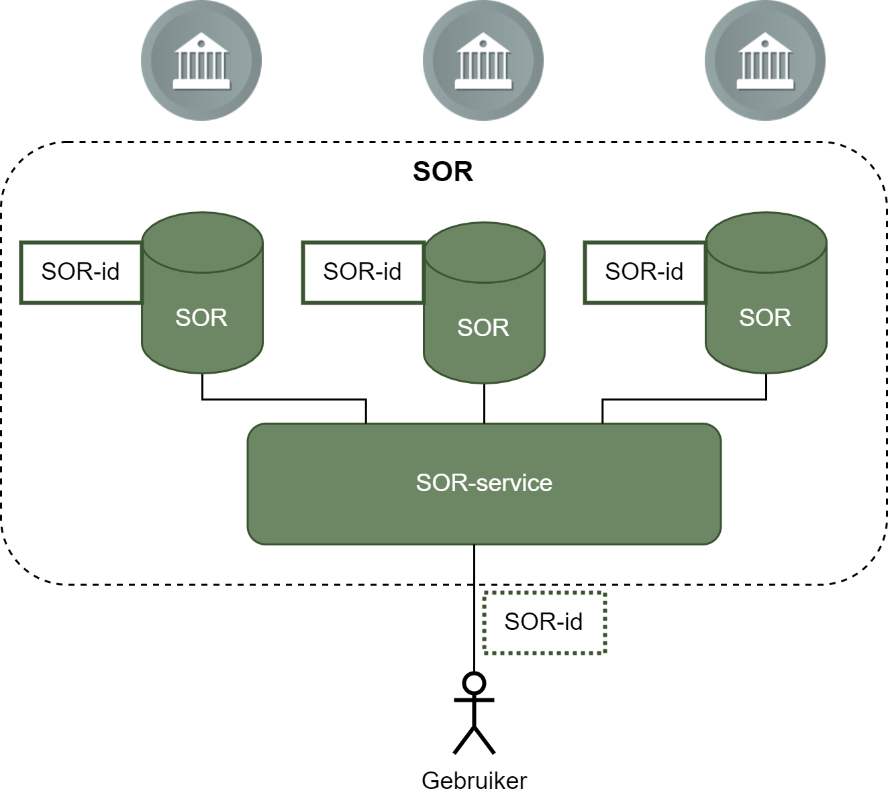

## Identificatie

Identificatie is een belangrijk aspect van informatiemodellering. Een identificatie is een middel om het onderwerp van gegevens te duiden.
In het kader van de SOR hanteren we de volgende uitgangspunten rondom identificatie.

*Uitgangspunten*

1. Een objectidentificatie binnen Nederland is globaal uniek. [[EMSO]]
1. De SOR kent een functionele objectidentificatie. De functionele objectidentificatie is systeem (implementatie) onafhankelijk.
   Een functionele objectidentificatie kan een of meer technische identificaties hebben. [[EMSO]]
1. Een objectidentificatie mag niet veranderen in de levensloop van het object zodat tijdreizen maximaal wordt gefaciliteerd. [[EMSO]]
1. Tijdens de transitieperiode naar de SOR facilieren we samenhang tussen gebruik van huidige basisregistratie-identificaties en de objectidentificatie van de SOR. [[EMSO]]
1. Alle onderwerpen van gegevens, waar individueel naar verwezen moet kunnen worden, krijgen een identificatie toegewezen.

Een belangrijk punt, gesteund door bovenstaande uitgangspunten, is dat we geen informatieobjecten identificeren, maar objecten. Ofwel, we identificeren de onderwerpen van gesprek (gebouw, weg, brug, etc.) en niet de gegevens over de onderwerpen.

### Modellering van identificatie

Voor de modellering van de functionele identificatie passen we het modelleerpatroon van NEN 3610 ().

<figure id="nen-3610-geo-object">
  
  <figcaption>NEN 3610 (ontw 2021) Modelleerpatroon GeoObject</figcaption>
</figure>

Hierin krijgen objecten een attribuut `identificatie` en een attribuut `domein`, waarbij:
* `identificatie` de unieke identificatie van het object is, en
* `domein` de unieke verwijzing naar een registratie van informatieobjecten is.

Ieder informatieobject heeft ook een set metadata genaamd `Registratiegegevens` waarin de gegevens over het informatieobject staan opgenomen, waaronder het gegeven met eigenschap `versie`. Dit is de versie-aanduiding van het informatieobject. Wanneer er een gegevenswijziging is in een informatieobject, zullen de `identificatie` en `domein` nooit wijzigen, maar de `versie` wel.

<aside class="note">
 Er is nog geen keuze gemaakt of een informatieobject zelf ook een identificatie toegewezen moet krijgen. Wanneer een informatieobject in de SOR altijd alleen over één geidentificeerd object gaat is het niet nodig om een identificatie voor een informatieobject te introduceren, gezien deze af te leiden is aan de combinatie van `identificatie`, `domein` en `versie`. Echter, wanneer er gekozen wordt om informatieobjecten te introduceren die meer dan één identificeerbaar object beschrijft, én het noodzakelijk is om naar een geheel informatieobject te kunnen verwijzen, dan is het wel nodig om een identificatie voor informatieobjecten te introduceren. Dit kan op het niveau van `Registratiegegevens`.
</aside>

**Openstaande vragen:**
1. Hoe moet de identificatie er uitzien?
2. Hoet gaat domein werken gegeven dat er momenteel geen register van registraties geidentificeerd door URI's bestaat?

#### Identificatie in Linked Data

De SOR moet compatibel zijn met, en ontsluitbaar zijn als, Linked Data. Linked data gebruikt http(s) URI's om onderwerpen van gegevens te duiden. Het ligt daarom voor de hand om een URI af te kunnen leiden uit de functionele identificatie conform NEN 3610.

Er zijn verschillende URI strategieen in omloop, waaronder:
- [Aanzet tot een nationale URI-Strategie voor Linked Data van de Nederlandse overheid](https://www.geonovum.nl/uploads/documents/D1-2013-09-19_Towards_a_NL_URI_Strategy.pdf)
- NEN 3610 (ontw 2021)
- [API- en URI-strategie Digitaal Stelsel Omgevingswet](https://iplo.nl/digitaal-stelsel/aansluiten/standaarden/api-en-uri-strategie/)

Wat deze URI strategieen gemeen hebben zijn dat ze in ieder geval volgende onderdelen van een URI onderscheiden.

- `http` of `https` - het protocol van de URI
- `domein` - het hoofddomein van de URI
- `type` - het objecttype van het onderwerp
- `referentie` - de referentie naar het specifiek onderwerp

Voor de SOR moet nog bepaald worden welke URI strategie gehanteerd gaat worden, en hoe URIs afgeleid kunnen worden.

### Identificatie in verschillende SOR-(transitie)scenario's

Om invulling te geven aan identificatie in de SOR moeten we ook weten hoe de SOR ingevuld gaat worden. Omdat dit op moment van schrijven nog niet concreet is ingevuld hebben we een aantal scenario's onderscheiden waarin identificatie verschillend kan worden ingevuld.

* Scenario 1 - SOR Registratie
* Scenario 2 - Federatieve laag met hergebruik bestaande identificaties
* Scenario 3 - Federatieve laag met SOR identificaties
* Scenario 4 - SOR participeert in UOI stelsel

#### Scenario 1 - SOR Registratie

In transitiescenario 1 neemt de SOR de registratie van de relevante gegevens van de huidige basisregistratie over. In dit scenario is krijgen alle bestaande objecten en alle nieuw te registreren objecten een nieuwe SOR identificatie.

<figure id="identificatie-scenario1">
  
  <figcaption>Identificatie in transitiescenario 1 - SOR Registratie</figcaption>
</figure>

Dit scenario kan gezien worden als een ideaalplaatje, waarin de SOR als federatieve registratie fungeert waar alle SOR objecttypes in gemuteerd worden. Op korte termijn wordt dit scenario niet waarschijnlijk geacht.

#### Scenario 2 - Federatieve laag met hergebruik bestaande identificaties

In dit scenario fungeert de SOR als een federatieve laag over de bestaande basisregistraties heen. De basisregistraties blijven in hun werking onaangetast.
In dit scenario wordt er geen nieuwe SOR identificatie geïntroduceerd voor objecten waarvoor er informatieobjecten in bestaande basisregistraties bestaan.

<figure id="identificatie-scenario2">
  
  <figcaption>Identificatie in transitiescenario 2 - SOR Registratie</figcaption>
</figure>

Een SOR-informatieobject wordt samengesteld uit informatieobjecten uit één of meer basisregistraties, door gebruik te maken van transponeringsregels en identificatie koppelingen.
De bestaande basisregistratie-identificaties worden in dit scenario nog steeds gebruikt. Wel zal er gekozen moeten worden welke identificatie leidend is per objecttype.

Er worden wél SOR identificaties geïntroduceerd indien er nieuwe objecttypes geregistreerd worden waar nog geen basisregistratie voor is.
#### Scenario 3 - Federatieve laag met SOR identificaties

Dit scenario is gelijk aan scenario 2, met het verschil dat er voor elk object, ook die beschreven in bestaande basisregistratie, een nieuwe SOR identificatie geintroduceerd wordt.

Het verschil tussen scenario 2 en 3 is dat er bij de koppelingen tussen de basisregistratie-identificaties ook een SOR-identificate wordt geregistreerd.

<figure id="identificatie-scenario3">
  
  <figcaption>Identificatie in transitiescenario 3 - SOR Registratie</figcaption>
</figure>

Voor de implementatie is er geen verschil tussen scenario 2 en 3, voor de gebruikers is er een groot verschil: zij gebruiken alleeen het SOR-id en kunnen daarmee alle gegevens over een object opvragen. 

#### Scenario 4 - SOR participeert in UOI stelsel

In [[UOI-ontw]] wordt het UOI stelsel geïntroduceerd voor het vereenvoudigen van het domein-overstijgend zoeken, vinden & semantisch interpreteren van gegevens over objecten in de gebouwde omgeving.

Op hoofdlijnen introduceert het UOI een domein-overtijgende unieke identificatie en een stelsel waarmee informatieobjecten uit verschillende domeinen over hetzelfde onderwerp gevonden kunnen worden.

Het UOI ontwerp [stelt](https://geonovum.github.io/UOI-Ontwerp/#object-versus-informatie-object):

> De eerste vraag die het onderzoeksteam zich heeft gesteld, is waaraan een UOI-code moet worden toegekend. Daarbij is van belang te bedenken dat elk domein een eigen kijk op de werkelijkheid kan hebben en dus eigen informatie-objecten kan hebben gedefinieerd. Allereerst is vastgesteld dat de UOI-code aan een informatie-object moet worden toegekend. Dat informatieobject kan zowel gegevens bevatten over een fysiek of een virtueel object in de gebouwde omgeving. De UOI-code wordt dus gekoppeld aan de informatieobjecten over de fysieke dan wel virtuele dingen (en dus niet aan die dingen zelf omdat de objectdefinities daarvan per domein kunnen verschillen).

Deze stelling introduceert een aantal incompatibiliteiten met de uitgangspunten voor identificatie in de SOR. Het koppelen van identificatie aan informatieobjecten en niet aan de objecten waar de informatieobjecten over gaan, maakt dat een identificatie niet gelijk kan blijven tijdens de levensloop van een object.
Daarnaast, stelt het UOI ontwerp dat er geen semantische harmonisatie zal plaatsvinden bij het introduceren van de UOI, maar dat er een verwantschap tussen informatieobjecten gerealiseerd gaat worden. Het is echter onduidelijk hoe dit in zijn werk zal gaan. Daarnaast is dit tegenstrijdig met de aanpak die gehanteerd wordt voor de SOR, waar semantische harmonisatie centraal staat.

Vanwege bovenstaande onduidelijkheden is dit scenario is niet verder uitgewerkt.
