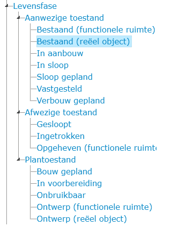
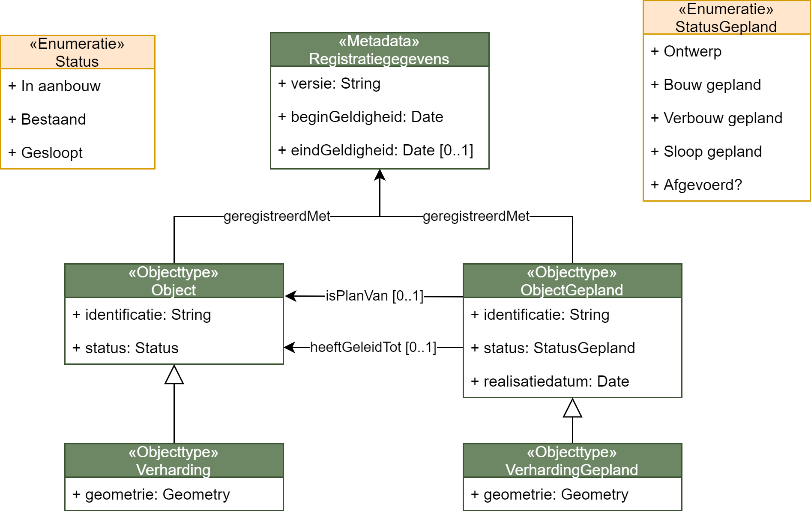

# Levensloop

Functionele eisen aan de levensfasen van objecten staan beschreven in [[EMSO]] [hoofdstuk 3.5.6 Levensfasen](https://docs.geostandaarden.nl/disgeo/emso/#levensfasen). Vaak wordt dit gemodelleerd als als ‘statussen’ of ‘toestanden’. 

De levensfasen van de verschillende categorieën van objecten zoals gespecificeerd in [[EMSO]] vatten we als volgt samen:

|Hoofdfase|Niet-vergunningplichtig|Vergunningplichtig|
|---------|-----------------------|------------------|
|Planfase |Gepland                |Gepland|
| | | Bouwvergunning verleend|
|Aanwezigheidsfase|Bestaand       |In aanbouw|
|         |                       |Bestaand|
|         |                       |In verbouw|
|         |                       |Sloopvergunning verleend|
|Afwezigheidsfase|Verwijderd      |Gesloopt|
|         |Niet gerealiseerd      |Niet gerealiseerd|
|         |Ten onrechte           |Ten onrechte|

<aside class="note">De levensfase <code>Afgevoerd</code> splitsen we in <code>Niet gerealiseerd</code> en <code>Ten onrechte</code> omdat we het onderscheid willen kunnen maken tussen gegevens over de levensloop van objecten in de werkelijkheid, en gegevens over de registratie van informatie over die objecten. Dit vanwege de definitie in [[EMSO]]: <em>"Object dat ten onrechte is opgevoerd in de registratie of waarvan is vastgesteld dat het ontwerp of een geplande bouw of aanleg niet heeft geleid tot een feitelijke realisatie van het object"</em>.</aside>

De levensfase `Ten onrechte` zetten we niet in dezelfde lijst, omdat deze status in tegenstelling tot de rest gaat over gegevens in plaats van het object zelf.

We modelleren de levensfasen als een taxonomische statuslijst, zodat een gebruiker eenvoudig bijvoorbeeld alle statussen die duiden op de aanwezigheid van een fysiek object kan opvragen. Zie [Statussen](https://begrippen.geostandaarden.nl/sor/nl/page/levensfasen) in het begrippenkader voor deze modellering.

Modellering van levensfasen wordt ingewikkeld als zaken moeten worden ondersteund zoals:
- situaties waarin er meerdere plannen zijn voor een object te ondersteunen
- toekomstmutaties

Tijdens bijeenkomsten van de expertgroep bleek dat dit soort eisen wellicht aan de orde zijn, hoewel het niet helemaal duidelijk werd. Dit maakte het echter wel nodig om modelleringen uit te werken waarin planobjecten als apart object worden gemodelleerd. We hebben 6 varianten uitgewerkt waarvan de volgende variant de voorkeur had: 

## Gepland object met realisatiedatum

Dit is een uitwerking van levensfasen die:
- Ondersteuning biedt voor simpele wijzigingen met toekomstmutaties
- Ondersteuning biedt voor meerdere plannen tegelijkertijd
- Ondersteuning biedt voor het bekijken van geplande objecten (icm met bestaande objecten) op een willekeurig moment in tijd.

In dit model is het volgende te zien: 
* expliciete relaties tussen `ObjectGepland`s en `Object`en
  * de relaties lopen van `ObjectGepland` naar `Object`. Daarmee verandert een object niet wanneer er een plan voor is.
  * de relatie `heeftGeleidTot` wordt alleen gelegd wanneer een plan daadwerkelijk leidt tot (een aanpassing van) een object.
* `realisatiedatum` op `ObjectGepland` om geplande toekomstsituatie te kunnen bekijken

Hiermee kan men de huidige en geplande werkelijkheid netjes scheiden van elkaar en toch alles terug vinden.

We sluiten dit hoofdstuk af met een reeks afbeeldingen waarin dit wordt uitgewerkt voor een complex scenario met meerdere geplande objecten. Er zijn nog enkele kanttekeningen bij deze oplossing: 
- de naamgeving zou nog beter in lijn gebracht kunnen worden met de [[NEN-2660-2]], dat ook een construct kent om levensfasen te modelleren. 
- Deze optie moet valide gehouden worden met regels (bijvoorbeeld status `gesloopt`, kan niet een relatie hebben met status `verbouw gepland`. Ook is er de 'businessrule' dat datums op elkaar af moeten worden gestemd.

<aside class="note">In afstemming met de werkgroep Inhoud is het onderwerp “Levensloop” uiteindelijk geparkeerd, in afwachting van een mogelijke wijziging (versimpeling) van de inhoudelijke eisen ten aanzien van levensloop van objecten. </aside>

