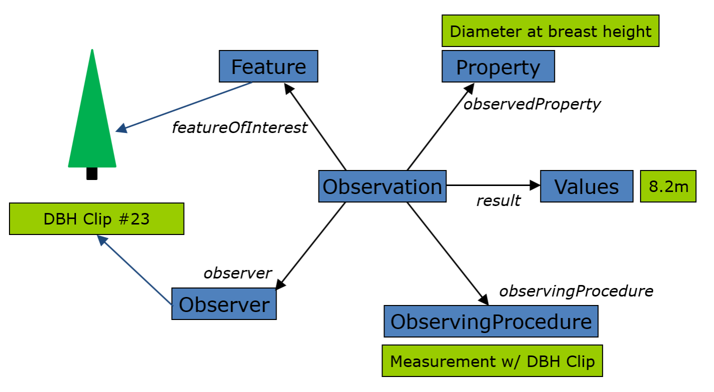
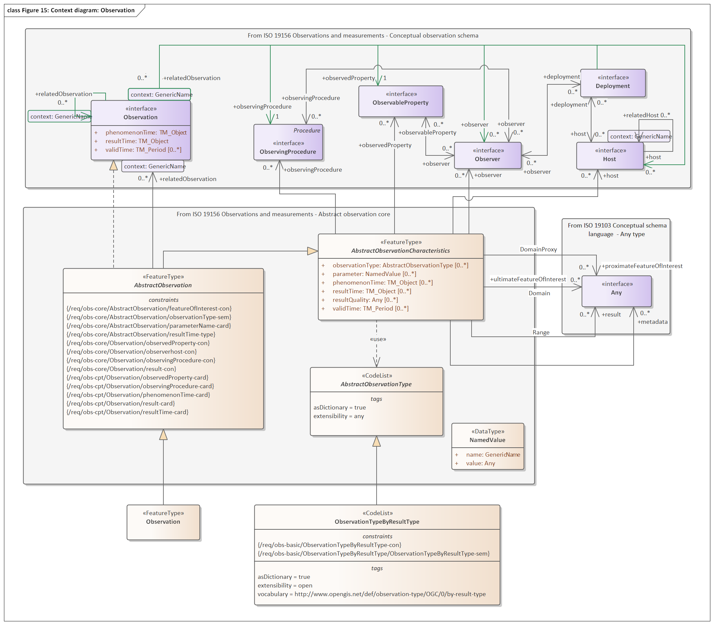

# De O&M standaard: Observations, Measurements and Samples

Voor convenience hier een overzicht in enkele afbeeldingen van de OGC standaard Observations, Measurements and Samples [[iso-19156-2021]] die mogelijk gebruikt wordt bij de modellering van plaatsbepalingspunten. 

Deze afbeelding toont op overzichtelijke wijze hoe de `Observation` is gemodelleerd: 

  <figure>
      
      <figcaption>Overzicht van eigenschappen van een observatie</figcaption>
  </figure>

Toelichting: 
- Een `Observation` is een waarneming, een "act carried out by an observer to determine the value of an observable property of an object (feature-of-interest) by using a procedure, with the value provided as the result". De waarneming is een gebeurtenis met eigenschappen en daarmee een objecttype.
- De `Feature of interest` is het onderwerp van de waarneming, de "subject of the observation". 
- De `Observed property` is de eigenschap waarvan de waarde wordt waargenomen, "The ObservableProperty that is the subject of the Observation". Verder geldt dat de waarde observeerbaar moet zijn: "The value for an instance of an observable property type can be estimated through an act of observation."

Verder belangrijk in dit informatiemodel zijn de `Observer`, de waarnemer (dit kan een persoon zijn maar vaak is dit een sensor die metingen doet), de `Procedure` i.e. de gebruikte observatiemethode, en natuurlijk het resultaat van de waarneming. Zoals beschreven in NEN 3610 is deze standaard van belang als het toegevoegde waarde heeft om metadata over de inwinning van meetgegevens vast te leggen. 

De volgende afbeelding toont het klassediagram van de klasse `Observation` met al zijn complexiteiten: 

  <figure>
      
      <figcaption>Volledig diagram van de eigenschappen van een observatie zoals gemodelleerd in O&M</figcaption>
  </figure>

