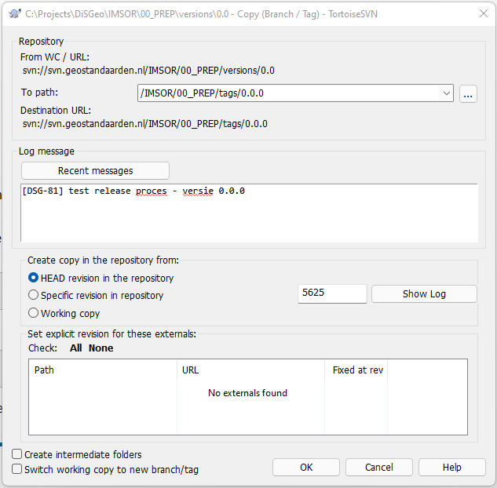

# IMSOR

## Versionering

### Semantic versioning

We volgen de [Semantic Versioning](https://semver.org/) aanpak, waarbij geversioneerde artefacten een versienummer toegekend krijgen in de vorm `MAJOR.MINOR.PATCH`.
De individuele elementen worden als volgt verhoogt:

1. `MAJOR` - wordt verhoogd bij wijzigingen die niet backwards-compatible zijn.
1. `MINOR` - wordt verhoogd bij toevoegingen aan een vorige versie die backwards-compatible zijn.
1. `PATCH` - wordt verhoogd bij compatibele bugfixes

### Inrichting SVN
Voor version control van het model gebruiken we [SVN](https://subversion.apache.org/).

Dat is:
```
├─ {path-to-artefact-dir}/versions/
└─ {path-to-artefact-dir}/tags/
```

Concreet betekent dat voor dit project de volgende foldertructuur

```
IMSOR/
├─ 01_CM/
│  ├─ versions/
│  └─ tags/
└─ 02_LM/
   ├─ versions/
   └─ tags/
```

Alleen in `versions/` staan bestanden waaraan wordt gewerkt. Onder `tags/` staan de daadwerkelijk gereleasete versies. Hier dient niet aan gewerkt te worden.

> **NOOT**: We wijken af van de de aangeraden mappenstructuur (`trunk/`, `branches/`, `tags/`) voor SVN omdat deze vooral bedoelt is voor het kunnen ontwikkelen van software features in verschillende branches welke weer teruggemerged worden in de trunk. In het geval van informatiemodellen in EA is dit geen optie. Er is geen goede mogelijkheid om branches terug te mergen.

### Werken aan een (nieuwe) versie

Wanneer we aan een nieuwe minor versie werken maken we een nieuwe map aan onder de `versions/` map met naam `MAJOR.MINOR`. Hierin staat altijd het meest up-to-date model voor deze versie. Het doorlopende werk aan deze versie wordt onder deze map gedaan, totdat er een release wordt gedaan van de versie.

Wanneer we aan een bestaande versie iets willen aanpassen kan dit door de versie in de map juiste map aan te passen.

### Commit-messages

We werken meestal adhv JIRA issues. Bij elke commit in het kader van een story moet het JIRA issue vermeld worden, met template:

```
[issue-nummer] beschrijving van de toeveogingen/wijzigingen
```

Bijvoorbeeld:

```
[DSG-81] beschrijving voor het werken aan en releasen van versies toegevoegd
```

### Releasen

Als we een nieuwe release `MAJOR.MINOR.PATCH` doen voor een `MAJOR.MINOR` versie dan volgen we eerst het release proces voor Imvertor (**TODO link of beschrijving toevoegen**). Wanneer deze succesvol is verlopen maken we in SVN een tag (of label in het Nederlands) aan.

De `PATCH` nummering begint bij 0.

Met [TortoiseSVN](https://tortoisesvn.net/) kan volgens [dit proces](https://tortoisesvn.net/docs/release/TortoiseSVN_nl/tsvn-dug-branchtag.html):

* Doe een rechtermuisklik op de `{path-to-artefact-dir}/versions/MAJOR.MINOR` map waarvoor je een release maakt
* Selecteer TortoiseSVN -> Branch/Tag... (Maak Tak/label... in het Nederlands)
* Voor de `To path:` vul je in `{path-to-artefact-dir}/tags/MAJOR.MINOR.PATCH` met de juiste waardes voor de drie versienummer elementen.
* Selecteer de HEAD revision voor de kopie



#### Bugfix als patch release

Wanner je voor een al gereleasete `MAJOR.MINOR.0` versie een bugfix/herstelactie moet doorvoeren kan het werk gewoon gedaan worden in de `versions/MAJOR.MINOR` map en kan er, wanneer het werk klaar is voor een patch release, een nieuwe release met een opvolgend `PATCH` nummer gedaan worden. We werken nooit direct in de `tags` mappen!

### Voorbeeld repository structuur

```
IMSOR/
├─ 01_CM
│  ├─ versions
│  │  ├─ 1.0
│  │  │  ├─ imsor-cm.xml
│  │  │  └─ bestuurlijke-gebieden.xml
│  │  └─ 1.1
│  │     ├─ imsor-cm.xml
│  │     └─ bestuurlijke-gebieden.xml
│  └─ tags
│  │  ├─ 1.0.0
│  │  │  ├─ imsor-cm.xml
│  │  │  └─ bestuurlijke-gebieden.xml
│  │  ├─ 1.0.1
│  │  │  ├─ imsor-cm.xml
│  │  │  └─ bestuurlijke-gebieden.xml
│  │  └─ 1.1.0
│  │     ├─ imsor-cm.xml
│  │     └─ bestuurlijke-gebieden.xml
└─ 02_LM
   ├─ versions
   └─ tags
```
