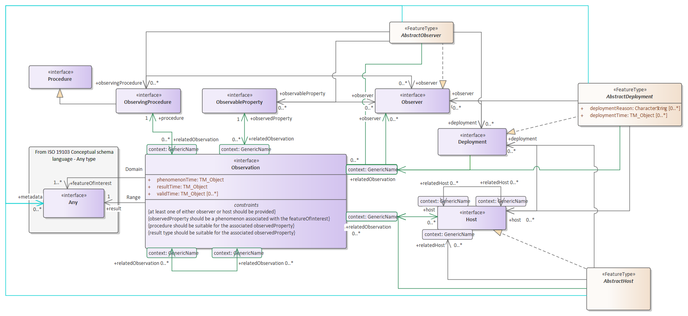

# Observations and measurements en de SOR

Dit document bevat overwegingen om te verkennen of er een modelleerprincipe / uitgangspunt nodig is om te zorgen dat OGC Observations & Measurements (O&M), en andere Geo-standaarden, voldoende aan te sluiten zijn op het SOR informatiemodel.

We vragen ons af of we in de SOR rekening moeten houden met het O&M modelleerpatroon. 

Relevant hiervoor:
- [OGC Topic 20, Observations & Measurements](https://portal.ogc.org/files/?artifact_id=41579) =  O&M 2.0. Is ook gepubliceerd als ISO 19156.
- [W3C/OGC Semantic Sensor Network Ontology (SSN)](https://www.w3.org/TR/vocab-ssn/), RDF implementatie van O&M, maar wel met een interpretatieslag gedaan en met uitbreidingen op O&M.
- [O&M 3.0 draft](https://portal.ogc.org/files/95653). Deze is recent in publieke consultatie geweest. Voor de SOR is het interessant om ons hierop aan te sluiten als we iets met O&M willen. Concepten uit SSN zijn hier weer in opgenomen.

## Wat is O&M en waarom is dit van belang

Uit de concept-versie van NEN 3610:2021: 

> In veel processen worden grote hoeveelheden meetgegevens verzameld. Meetgegevens zeggen vaak iets over objecten in de werkelijkheid. In dat geval zijn de meetgegevens aan een geo-object gerelateerd. Maar indien de locatie waar de meetgegevens worden opgenomen ook van belang is wordt de meting zelf ook een geo-object. Hierdoor ontstaat een complexe relatie tussen de feitelijke geo-objecten waaraan is gemeten en de locatie waarover die meting een uitspraak doet.

> Voor het modelleringen van zulke meetgegevens is de internationale OGC/ISO norm 19156, Observations and Measurements [iso-19156-2011] beschikbaar. Deze standaard beschrijft een informatiemodel rondom waarnemingen (observaties) van aspecten van fenomenen in de werkelijkheid. Deze waarnemingen worden gedaan volgens een bepaalde procedure, die of ter plekke bij het fenomeen in de werkelijkheid, of - na monstername - elders kan worden uitgevoerd, en heeft een resultaat, een meetwaarde. ISO 19156 is bedoeld voor gevallen waarbij niet alleen het meetresultaat interessant is om uit te wisselen, maar ook informatie over de activiteit van het meten, bijvoorbeeld door wie, wanneer of hoe de meting verkregen is.

> Regel:

> Voor de uitwisseling van meetgegevens moet, wanneer er behoefte bestaat om niet alleen meetresultaat uit te wisselen maar ook informatie over de activiteit van het meten, ISO 19156: Observations and Measurements gebruikt worden. 

O&M modelleert de *observatie* als activiteit die op een bepaalde locatie en tijdstip plaatsvindt, waarbij middels een bepaalde *procedure* (bijvoorbeeld een gestandaardiseerd proces met stappen), door een *observator* (bijvoorbeeld een mens of een sensor) een waarde (het *resultaat* van de observatie) wordt toegekend aan een *eigenschap* van een ding in de werkelijkheid, een *object*. 

Simpel voorbeeld: het meten van de omtrek van een boomstam.  
- De observatie = het meten
- Procedure = met een meetlint
- Observator = de persoon die de observatie doet
- Waarde = bv 30 centimeter
- Eigenschap = omtrek stam
- Ding in de werkelijkheid = de boom 

## Aanknopingspunten in modelleerprincipes
- Doelstelling vanuit architectuurvisie DisGEO: *Meer en eenvoudiger gebruik van deze informatie in maatschappelijke toepassingen.*

Het relateren van meetgegevens aan objecten in de werkelijkheid is een voorbeeld van gebruik van de informatie in een maatschappelijke toepassing. 

- Vanuit beleidsvisie SOR: *Vanuit andere (basis)registraties, zoals de subjectenregistraties BRP of HR, moeten eenvoudig relaties gelegd kunnen worden naar de samenhangende objectenregistratie.*

Ook vanuit een registratie van meetgegevens (zoals we bijvoorbeeld kennen uit de BRO maar ook metingen van waterkwaliteit, luchtkwaliteit, geluidsoverlast etc.) moeten eenvoudig relaties gelegd kunnen worden naar objecten uit de SOR. Bijvoorbeeld waterkwaliteitsmetingen kunnen relateren aan het geobserveerde waterlichaam.

- Uitgangspunt 1 uit Modelleerprincipes: *Het informatiemodel (IMSOR) bevordert samenhang tussen objecten in registraties*, en 
- Principe 1 uit Modelleerprincipes: *Objecten zijn (her)bruikbaar in verschillende registraties (invulling van U1)*

Om samenhang van meetgegevens met de objecten waar de meetgegevens over gaan moet bevorderd worden door het informatiemodel zo in te richten dat metingen gemakkelijk aan objecten gerelateerd kunnen worden.

- Uitgangspunt 2 uit Modelleerprincipes, sub punt: *De ontwikkeling van het informatiemodel wordt tenslotte zoveel als mogelijk afgestemd met andere relevante nationale, Europese en wereldwijde standaarden, zoals bijvoorbeeld CityGML en de INSPIRE standaarden.* 

Ook O&M is zo'n internationale stanaard. Bovendien is hiervan een Nederlandse uitwerking, het IMMetingen, dat op de lijst Open standaarden van Forum Standaardisatie staat. We moeten hier dus zoveel als mogelijk mee afstemmen.

- Aandachtspunt in Modelleerprincipes: *De betekenis van metadata is ook afhankelijk van de context: metadata is technisch gezien ook data (die iets zegt over andere data). Het kan dus op bepaalde momenten ook als data worden gezien - voorbeeld?*

O&M wordt wel gezien als een metadata-model, omdat het gegevens *over* observaties en metingen modelleert. 

## Moeten we iets met O&M en zo ja, wat?

Uit de diverse uitgangspunten en principes kunnen we concluderen dat de SOR moet faciliteren dat observaties en metingen, die conform O&M (eventueel specifieker IMMetingen) worden geregistreerd, kunnen worden gerelateerd aan objecten uit de SOR, zoals gebouwen, bomen, lantaarnpalen, terreinen of waterlichamen.

O&M heeft een algemeen modelleerpatroon om observaties te relateren aan objecten. Het modelleert de hoofdklassen `Observation`, `ObservingProcedure`, `Observer`, `ObservableProperty`, en `Result`, maar **niet** de klasse voor het object waarvan een eigenschap wordt geobserveerd, de "feature of interest". O&M doet de aanname dat een klasse voor dit object elders, in een domeinmodel, is gemodelleerd en dat het onderwerp van de observatie over het algemeen als object in een andere registratie is opgenomen dan de observaties over dat object. De relatie `featureOfInterest` modelleert O&M naar de placeholderklasse `Any`.

Stelt O&M eisen aan de klasse van objecten, die in de context van O&M als feature of interest worden beschouwd? 

Kort gezegd: nee. O&M **houdt open** wat de klasse is van het geobserveerde object, maar modelleert alleen de relatie ernaartoe:  de “`featureOfInterest`” relatie tussen `Observation` en `Any`. De `Any` klasse kan bijvoorbeeld een `owl:Thing`, `featureType`, of `dataType` zijn.  

Citaat uit de O&M 3.0 draft: 
> 6.3	Note on the use of Any

> The UML models defined in this International Standard make extensive use of the Any interface defined in ISO 19103:2015 Any type package. The realized Any values of the associations with role names proximateFeatureOfInterest, ultimateFeatureOfInterest, result, metadata, featureOfInterest and sampledFeature MAY be of any type or a reference to an digital representation of an appropriate concept. In the case they are of feature type, the values are not owned by the instances of referring classes, they may have an independent life span from the referring classes, and they may be associated with more than one instance of referring classes.

In het logisch model van de SOR is het raadzaam om het ISO 19109 stereotype `<<FeatureType>>` hanteren, om aan te sluiten op internationale geo-standaarden zoals O&M. Maar het is niet per sé nodig. Om mogelijk te maken dat observaties die gaan over fysieke objecten uit de SOR eraan gerelateerd kunnen worden, is het voldoende als de SOR objecten een persistent en uniek ID hebben.
